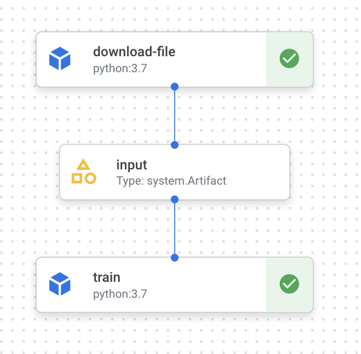

# kubeflow-vertex-ai

## Credit to @Brian_Kang (https://github.com/brianchunkang) for the distributed training script

## This notebook shows how to go from EDA to a working Vertex AI pipeline (kubeflow)

